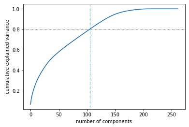
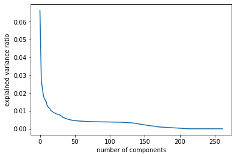
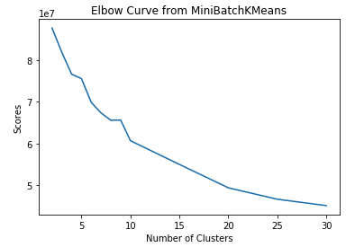
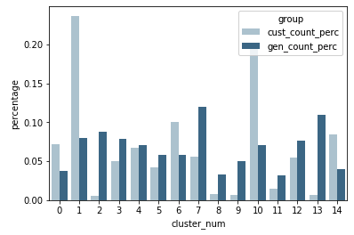

# Identify Customer Segments

## Background Information

The data here concerns a company that performs mail-order sales in Germany. Their main question of interest is to identify
facets of the population that are most likely to be purchasers of their products for a mail campaign.
In this project, I applied dimensionality reduction and unsupervised learning techniques
to organize the general population dataset into clusters, then use those clusters
to see which of them comprise the main user base for the company. Prior to applying the machine learning methods,
I assessed and cleaned the data in order to convert it into a usable form.

## Data Preprocessing

The general population dataset required several preprocessing steps in order to later use PCA and KMeans. I converted missing
values to NaNs, and then plotted a histogram with the number of nulls in each column of the data. After removing
outlier columns that had more than 33% missing values, I also analyzed the count of missing values within each row. To handle
categorical data, I one hot encoded several columns and engineered new features from columns with mixed data types.
Then, I wrote a cleaning function that would take a dataframe and apply all necessary preprocessing steps for later use
with the customer dataset.

## Feature Transformation

For the remaining columns with missing values, I imputed the mean of each column in order to be able to pass the dataframe
to sklearn's estimators. After the missing values were cleaned up, I scaled the data using StandardScaler and then reduced
the dimensionality of the dataset using PCA.

One of the most interesting steps in the project was interpreting the principal
components. I did this by mapping the weights from the principal components to the corresponding feature names, sorting by
the weights, and finally examining the columns in the data dictionary with the largest and smallest weights. This enabled me
to infer that the first principal component was associated with low income, the second with shopping and high spending
behavior, etc.

## Clustering

Now that the data was cleaned and transformed, I utilized MiniBatchKMeans to quickly assess the cluster scores for varying
cluster sizes.

Next, I applied all of the cleaning steps, imputation, scaling, PCA, and KMeans to the customer dataset.

By plotting the proportion of data in each cluster for the customer dataset and general population, I was able to identify
that the customer dataset had more high income families (suggesting this was a target audience for the company). I also
discovered that lower income and more socially-oriented people were underrepresented in the customer data compared to
the general population.
